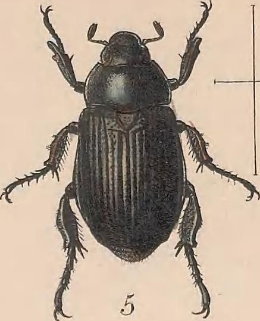
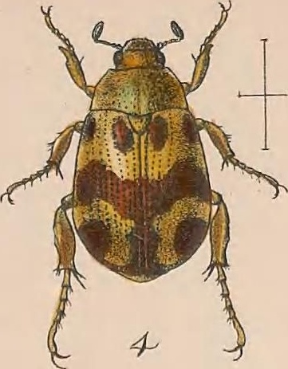
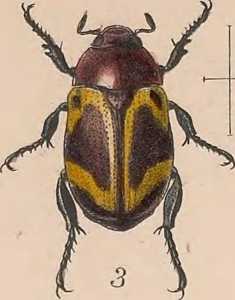
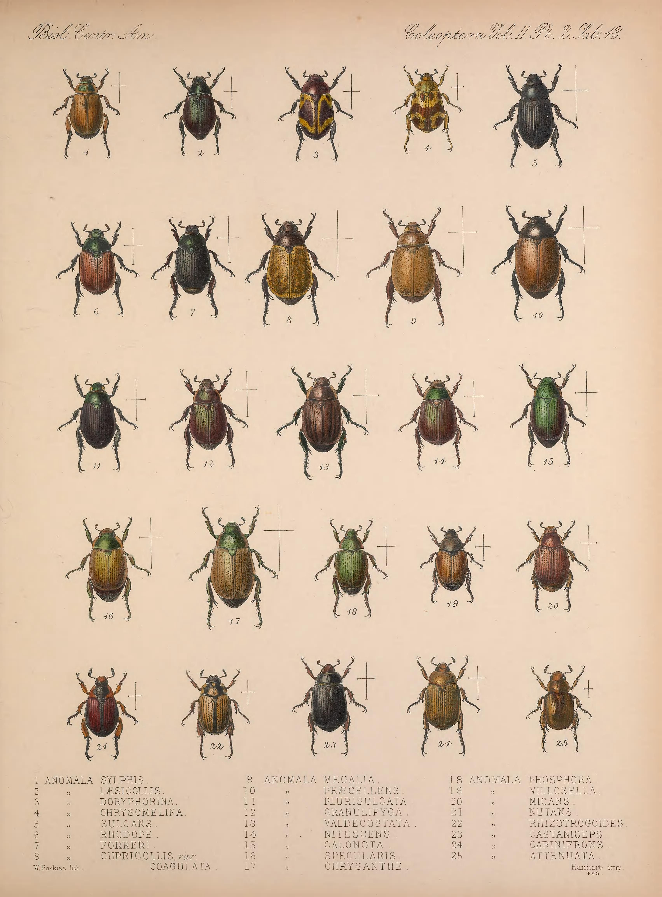

# insectcrop
Cropping insects from images for later processing on GAN.

Usage:
- `git clone https://github.com/erasta/insectcrop.git`
- `pip install opencv-python`
- `python -m insectcrop`

`out` folder will contain all insects

 
from:

